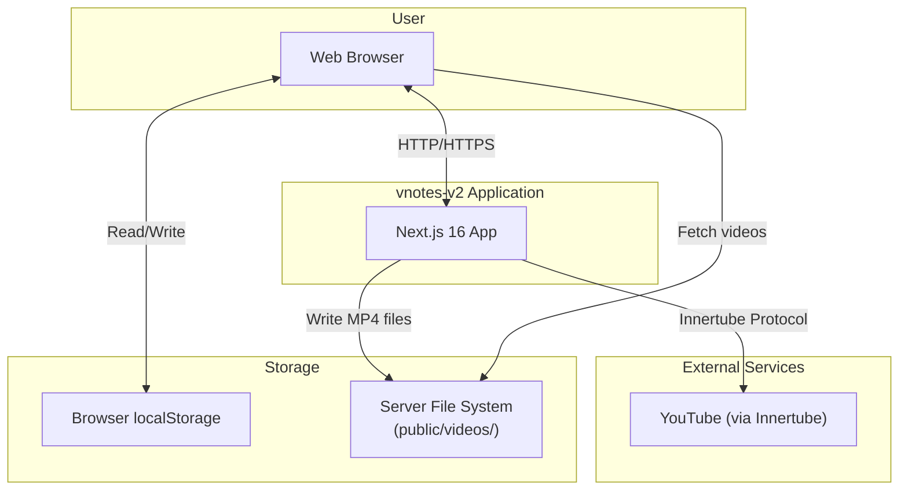
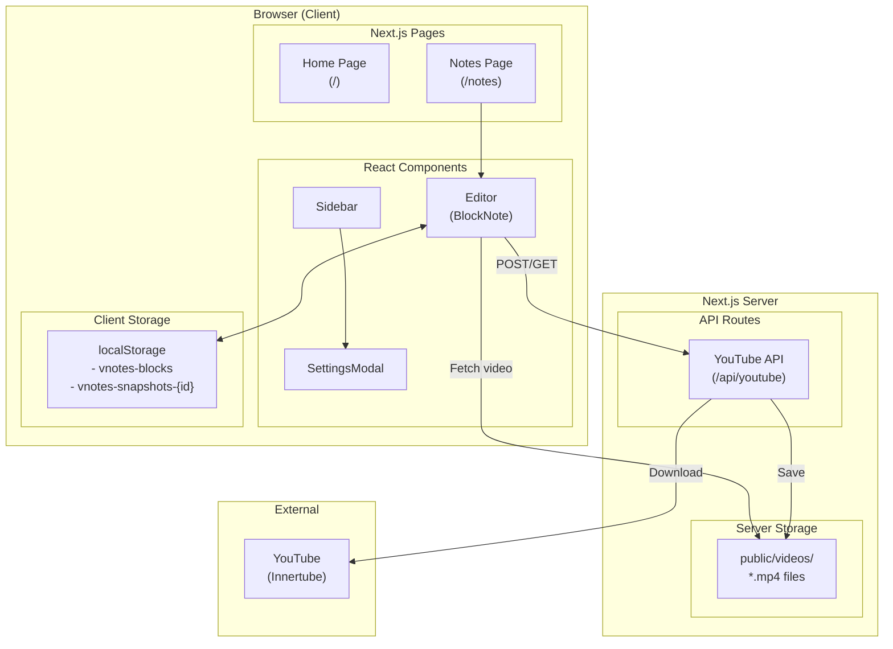
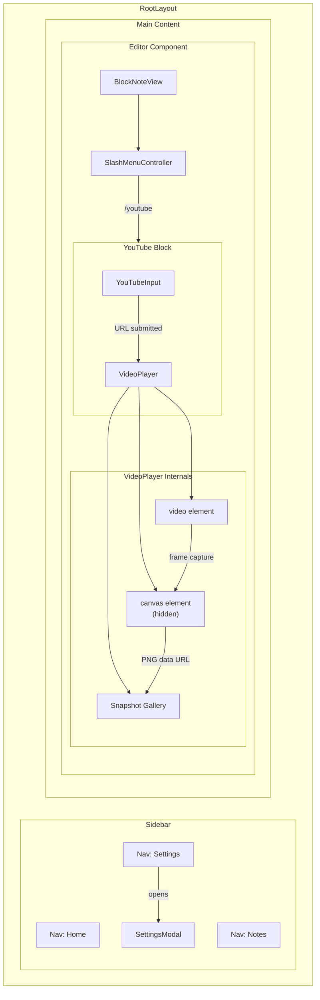
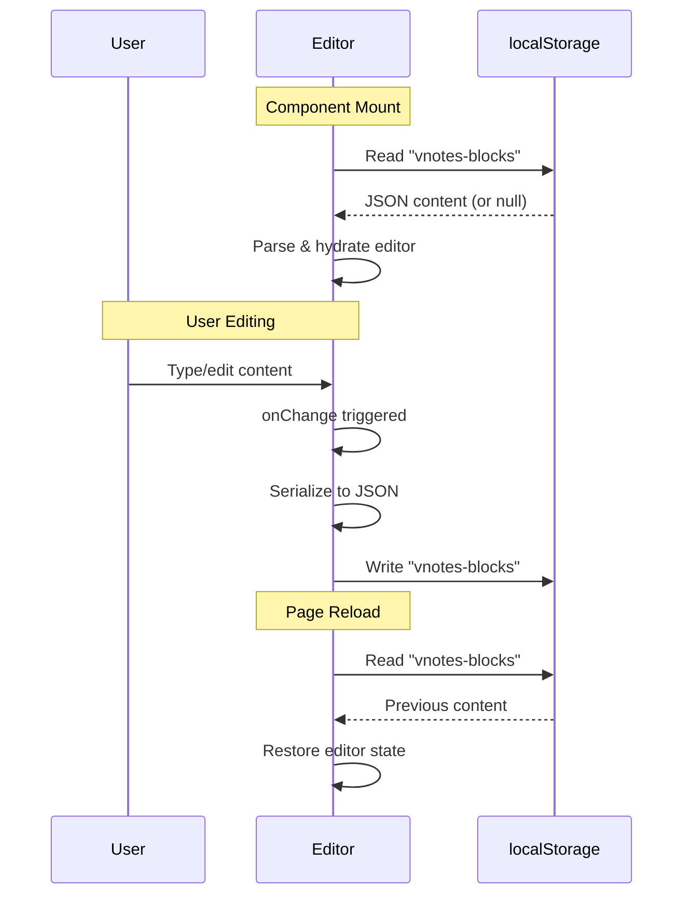
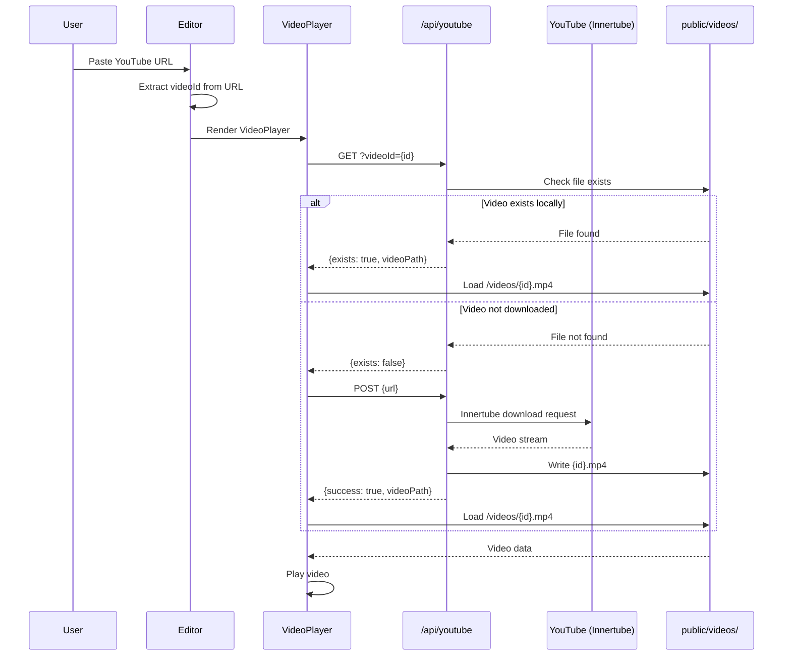
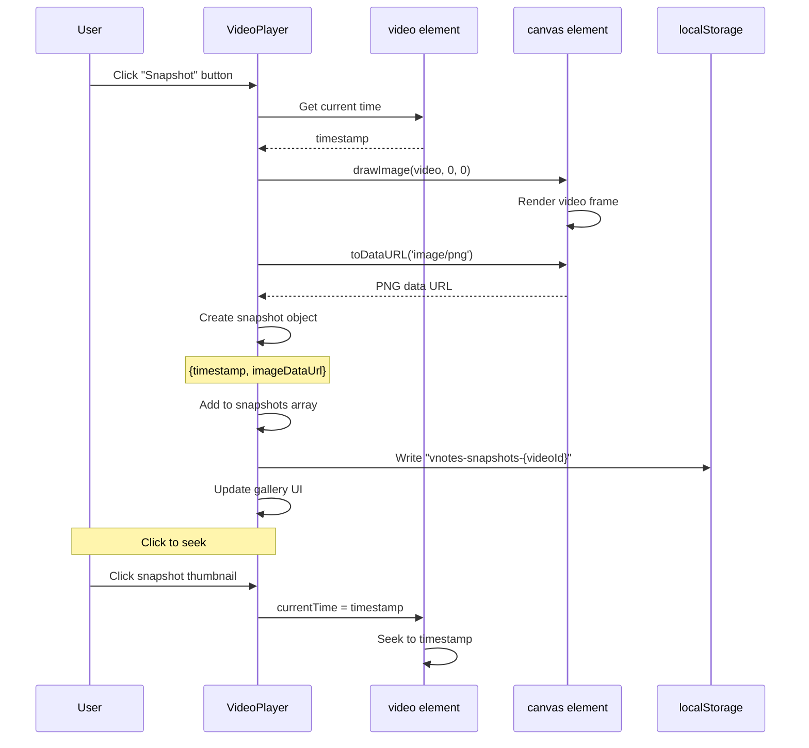
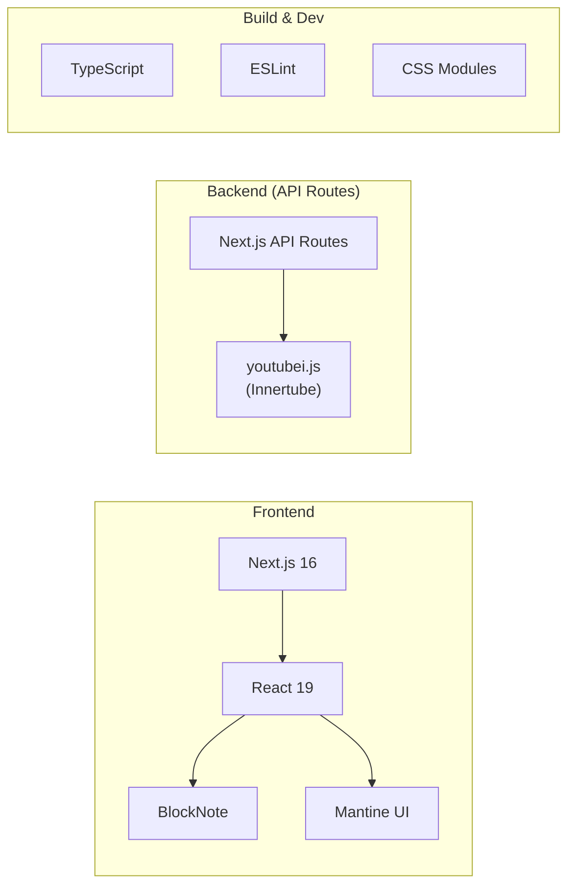

# vnotes-v2 Architecture Diagrams

This document contains architecture diagrams for the vnotes-v2 note-taking application.

---

## System Context

High-level view of how vnotes-v2 interacts with external systems and users.



### Legend
- **User** - End user accessing the application via web browser
- **vnotes-v2 Application** - The Next.js application (frontend + API routes)
- **YouTube** - External video source accessed via Innertube protocol
- **Browser localStorage** - Client-side persistence for notes and snapshots
- **Server File System** - Local storage for downloaded video files

### Assumptions
- Single-user local deployment (no multi-user or cloud storage)
- Videos are downloaded and stored locally for offline playback
- No authentication or user management required
- Browser localStorage is sufficient for note persistence

---

## Application Container Diagram

Shows the main containers/modules within the application.



### Legend
- **Pages** - Next.js page routes (server/client components)
- **Components** - React UI components
- **API Routes** - Next.js API handlers
- **localStorage** - Browser-based key-value storage
- **public/videos/** - Server filesystem for downloaded videos

### Assumptions
- Editor component is client-only (dynamic import with SSR disabled)
- All pages share the same Sidebar layout
- Video files are served statically from public directory

---

## Component Hierarchy

Detailed view of the component structure and relationships.



### Legend
- **RootLayout** - App shell with sidebar and main content area
- **Sidebar** - Fixed navigation with settings modal trigger
- **Editor** - BlockNote-based rich text editor
- **YouTubeBlock** - Custom block type for video embedding
- **VideoPlayer** - Video playback with snapshot capability

### Assumptions
- Editor is the only component in the notes page
- Sidebar is persistent across all pages
- VideoPlayer handles both playback and snapshot capture

---

## Data Flow: Note Persistence

How note content is saved and loaded.



### Legend
- **User** - Person editing notes
- **Editor** - BlockNote editor component
- **localStorage** - Browser key-value storage

### Assumptions
- Content is auto-saved on every change
- No debouncing or throttling of saves
- Single document model (no multiple notes)

---

## Data Flow: YouTube Video Download

How videos are downloaded and played locally.



### Legend
- **Editor** - Rich text editor with YouTube block
- **VideoPlayer** - Video playback component
- **/api/youtube** - Server-side API route
- **YouTube (Innertube)** - External video source
- **public/videos/** - Local video storage

### Assumptions
- Videos are downloaded in best quality (video+audio)
- ANDROID client type used for progressive formats
- No streaming - full download before playback
- No cleanup of old videos

---

## Data Flow: Snapshot Capture

How video snapshots are captured and stored.



### Legend
- **VideoPlayer** - Component managing video and snapshots
- **video element** - HTML5 video player
- **canvas element** - Hidden canvas for frame capture
- **localStorage** - Snapshot persistence

### Assumptions
- Canvas dimensions match video dimensions
- PNG format used for quality preservation
- Snapshots are persisted per-video (by videoId)
- User can delete individual snapshots

---

## Technology Stack



### Legend
- **Next.js 16** - React framework with App Router
- **React 19** - UI library
- **BlockNote** - Rich text editor framework
- **Mantine** - UI component library
- **youtubei.js** - YouTube download via Innertube protocol

### Assumptions
- Using latest stable versions
- No additional backend services required
- Development uses npm scripts

---

## File Structure

```
vnotes-v2/
├── src/
│   ├── app/
│   │   ├── layout.tsx          # RootLayout with Sidebar
│   │   ├── page.tsx            # Home page (/)
│   │   ├── globals.css         # Global styles & CSS variables
│   │   ├── notes/
│   │   │   └── page.tsx        # Notes page with Editor
│   │   └── api/
│   │       └── youtube/
│   │           └── route.ts    # YouTube download API
│   └── components/
│       ├── Editor.tsx          # BlockNote editor + YouTube blocks
│       ├── Sidebar.tsx         # Navigation sidebar
│       ├── Sidebar.module.css
│       ├── SettingsModal.tsx   # Settings overlay
│       └── SettingsModal.module.css
├── public/
│   └── videos/                 # Downloaded YouTube videos (gitignored)
├── docs/
│   └── DIAGRAMS.md             # This file
├── package.json
├── tsconfig.json
└── CLAUDE.md                   # AI assistant instructions
```

---

## Future Considerations

Potential areas for expansion (not currently implemented):

1. **Multi-note Support** - Replace single localStorage key with note ID-based storage
2. **Cloud Sync** - Add backend database for cross-device sync
3. **User Authentication** - Add login/signup for multi-user support
4. **Video Cleanup** - Implement TTL or manual cleanup for downloaded videos
5. **Collaborative Editing** - Real-time multi-user editing with conflict resolution
